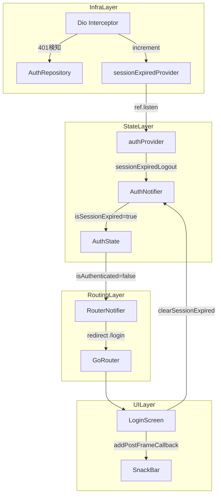
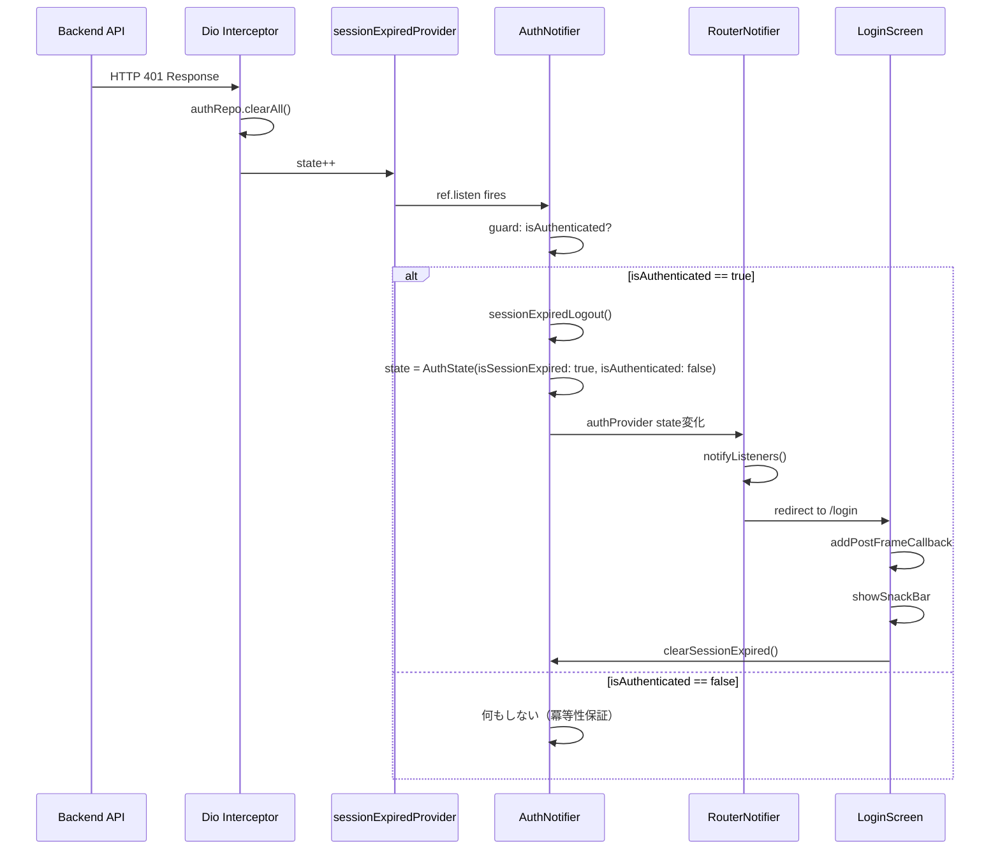

# 設計ドキュメント: auth-token-redirect

## Overview

本機能は、JWTアクセストークンの期限切れを自動検知し、ユーザーをログインページへリダイレクトするとともに、セッション切れをSnackBarで通知する。

**Purpose**: APIリクエスト時に発生する HTTP 401 レスポンスをトークン期限切れのシグナルとして処理し、ユーザーが安全かつスムーズに再認証できる体験を提供する。

**Users**: アプリを利用中にセッションが切れた全ユーザー。画面操作なしで自動的にログイン画面へ誘導され、理由がSnackBarで明示される。

**Impact**: 既存の Dio インターセプター・`sessionExpiredProvider`・GoRouter リダイレクトは動作済みのため、変更は `AuthState` へのフラグ追加、`AuthNotifier` へのメソッド追加、および `LoginScreen` への通知処理追加の3ファイルに限定される。

### Goals

- HTTP 401 レスポンスをトリガーとした自動セッション終了とリダイレクトを完成させる
- セッション切れをユーザーに SnackBar で通知し、通常ログアウトと区別する
- 複数の 401 が連続した場合の冪等性を保証する

### Non-Goals

- トークンのリフレッシュ（本機能はリフレッシュせず即ログアウト）
- バックグラウンドプッシュ通知によるセッション切れ通知
- バックエンド側のセッション管理変更

---

## Requirements Traceability

| 要件ID | 概要 | コンポーネント | インターフェース | フロー |
|--------|------|---------------|----------------|--------|
| 1.1 | HTTP 401 でセッション終了を開始 | `DioInterceptor`（既存） | `sessionExpiredProvider` | セッション終了フロー |
| 1.2 | 全認証済みリクエストを監視 | `DioInterceptor`（既存） | — | — |
| 1.3 | 複数 401 の冪等性保証 | `authProvider`（修正） | `ref.listen` ガード | セッション終了フロー |
| 2.1 | JWT トークン削除 | `AuthRepository`（既存） | `clearAll()` | — |
| 2.2 | `isAuthenticated` リセット | `AuthNotifier`（修正） | `sessionExpiredLogout()` | — |
| 2.3 | 全セッション状態クリア | `AuthRepository`（既存） | `clearAll()` | — |
| 3.1 | `/login` 自動遷移 | `_RouterNotifier`（既存） | `redirect()` | セッション終了フロー |
| 3.2 | リダイレクトループ防止 | `_RouterNotifier`（既存） | `isAuthRoute` チェック | — |
| 3.3 | 認証必要ページのブロック | `_RouterNotifier`（既存） | `redirect()` | — |
| 4.1 | SnackBar 通知表示 | `LoginScreen`（修正） | `initState` コールバック | 通知フロー |
| 4.2 | 遷移後に SnackBar 表示 | `LoginScreen`（修正） | `addPostFrameCallback` | 通知フロー |
| 4.3 | 通常ログアウトとの区別 | `AuthState`（修正）・`AuthNotifier`（修正） | `isSessionExpired` フラグ | — |

---

## Architecture

### Existing Architecture Analysis

既存の認証フローは以下のレイヤーで構成されている：

- **インフラ層** (`api_client.dart`): `dioProvider` の `InterceptorsWrapper` が HTTP 401 を検知し、`sessionExpiredProvider`（`StateProvider<int>`）をインクリメント
- **状態管理層** (`auth_provider.dart`): `authProvider` の `ref.listen` が `sessionExpiredProvider` の変化を監視し `logout()` を呼び出す
- **ルーティング層** (`router.dart`): `_RouterNotifier` が `authProvider` を監視し、`isAuthenticated: false` をトリガーに `/login` へリダイレクト

このフローで Requirement 1〜3 は概ね充足しているが、**冪等性ガードの欠如**（1.3）と **SnackBar通知の未実装**（4.x）がギャップとなっている。

### Architecture Pattern & Boundary Map



**Architecture Integration**:
- **既存パターン**: Riverpod `StateNotifierProvider` + `ref.listen` を維持
- **新規追加**: `AuthState.isSessionExpired` フラグ、`AuthNotifier.sessionExpiredLogout()`、`LoginScreen` の通知処理
- **境界**: 通知責務は `LoginScreen` に限定し、`AuthNotifier` はフラグ管理のみ担当

### Technology Stack

| レイヤー | 技術 | 本機能での役割 | 備考 |
|----------|------|----------------|------|
| 状態管理 | `flutter_riverpod`（既存） | `isSessionExpired` フラグの管理 | 既存パターン踏襲 |
| HTTP | `dio`（既存） | 401 検知インターセプター | 変更なし |
| ストレージ | `flutter_secure_storage`（既存） | トークン削除 | 変更なし |
| ルーティング | `go_router`（既存） | ログイン画面へのリダイレクト | 変更なし |
| UI通知 | `ScaffoldMessenger`（既存） | SnackBar 表示 | `main.dart` の `snackBarTheme` 適用済み |

---

## System Flows

### セッション終了フロー（401 → リダイレクト）



### 通常ログアウトフロー（比較）

通常の `logout()` は `isSessionExpired` を `true` にしないため、`LoginScreen` の SnackBar は表示されない（4.3 を満たす）。

---

## Components and Interfaces

### コンポーネントサマリー

| コンポーネント | レイヤー | 役割 | 要件カバレッジ | 変更種別 |
|----------------|----------|------|---------------|----------|
| `AuthState` | 状態モデル | セッション切れフラグの保持 | 4.3 | 修正（フィールド追加） |
| `AuthNotifier` | 状態管理 | セッション切れログアウト・フラグクリア | 1.3, 2.2, 4.3 | 修正（メソッド追加） |
| `authProvider` ref.listen | 状態管理 | 冪等性ガード付き 401 ハンドリング | 1.3 | 修正（ガード追加） |
| `LoginScreen` | UI | セッション切れ SnackBar 通知 | 4.1, 4.2 | 修正（initState 追加） |
| `DioInterceptor` | インフラ | 401 検知・トークンクリア | 1.1, 1.2, 2.1, 2.3 | 変更なし |
| `_RouterNotifier` | ルーティング | `/login` 自動リダイレクト | 3.1, 3.2, 3.3 | 変更なし |

---

### State Layer

#### AuthState

| Field | Detail |
|-------|--------|
| Intent | `isSessionExpired` フラグを追加し、セッション切れによるリダイレクトを通常ログアウトと区別する |
| Requirements | 4.3 |

**Responsibilities & Constraints**
- `isSessionExpired: bool`（デフォルト `false`）を保持する
- `logout()` によるリセット時は `false` のまま（通常ログアウトと区別）
- `sessionExpiredLogout()` 後にのみ `true` となる

**Contracts**: State [x]

##### State Management

```dart
class AuthState {
  final bool isAuthenticated;
  final String? accountId;
  final bool isLoading;
  final String? errorMessage;
  final bool isSessionExpired; // 追加

  const AuthState({
    this.isAuthenticated = false,
    this.accountId,
    this.isLoading = false,
    this.errorMessage,
    this.isSessionExpired = false, // 追加
  });

  AuthState copyWith({
    bool? isAuthenticated,
    String? accountId,
    bool? isLoading,
    String? errorMessage,
    bool clearError = false,
    bool? isSessionExpired, // 追加
  });
}
```

- **State model**: `isSessionExpired` は一時フラグ。`LoginScreen` が SnackBar 表示後に `clearSessionExpired()` を呼びリセットする
- **Persistence**: メモリのみ（アプリ起動時は常に `false`）
- **Concurrency**: `ref.listen` のガードにより、`sessionExpiredLogout()` は `isAuthenticated == true` の場合のみ実行

---

#### AuthNotifier

| Field | Detail |
|-------|--------|
| Intent | セッション切れログアウト（`isSessionExpired: true` 付き）とフラグクリアのメソッドを追加する |
| Requirements | 1.3, 2.2, 4.3 |

**Responsibilities & Constraints**
- `sessionExpiredLogout()`: `isSessionExpired: true` を立てた上で `clearAll()` + 認証状態リセット
- `clearSessionExpired()`: `isSessionExpired` を `false` に戻す（`LoginScreen` が呼び出す）
- 既存の `logout()` は変更しない（4.3 の区別を保つため）

**Dependencies**
- Inbound: `authProvider` の `ref.listen` — 401 イベントを受信 (P0)
- Inbound: `LoginScreen` — `clearSessionExpired()` 呼び出し (P1)
- Outbound: `AuthRepository.clearAll()` — ストレージクリア (P0)

**Contracts**: Service [x] / State [x]

##### Service Interface

```dart
abstract class AuthNotifierInterface {
  /// セッション切れログアウト: isSessionExpired=true でリダイレクト判定に使用
  Future<void> sessionExpiredLogout();

  /// SnackBar表示後にフラグをリセット
  void clearSessionExpired();

  // 既存メソッド（変更なし）
  Future<bool> login(String accountId, String password);
  Future<String?> register(String name, String password);
  void completeRegistration();
  Future<void> logout();
}
```

- Preconditions: `sessionExpiredLogout()` は `isAuthenticated == true` の場合のみ呼ばれる（`ref.listen` ガードで保証）
- Postconditions: `sessionExpiredLogout()` 後、`state.isAuthenticated == false && state.isSessionExpired == true`
- Invariants: `logout()` 後は `state.isSessionExpired == false`（通常ログアウトとの区別）

**Implementation Notes**
- Integration: `ref.listen` の `if (state.isAuthenticated)` ガードを `authProvider` 定義に追加
- Validation: `clearSessionExpired()` は `mounted` チェック後に `LoginScreen` から呼び出す
- Risks: `addPostFrameCallback` 内で `ref.read` を使用するため、Widget がアンマウントされている場合を `mounted` チェックで防ぐ

---

### UI Layer

#### LoginScreen（修正部分）

| Field | Detail |
|-------|--------|
| Intent | マウント時に `isSessionExpired` を確認し、セッション切れSnackBarを表示する |
| Requirements | 4.1, 4.2 |

**Responsibilities & Constraints**
- `initState` 内で `addPostFrameCallback` を使用し、フレーム描画後にフラグを確認する
- SnackBar 表示後は必ず `clearSessionExpired()` を呼び出してフラグをリセットする
- 通常のログイン失敗 SnackBar（赤色）と視覚的に区別するため、セッション切れ通知はオレンジ色で表示する

**Dependencies**
- Inbound: GoRouter — セッション切れリダイレクト後に画面がマウントされる (P0)
- Outbound: `AuthNotifier.clearSessionExpired()` — フラグリセット (P1)
- External: `ScaffoldMessenger` — SnackBar 表示 (P0)

**Contracts**: State [x]

##### State Management

`initState` + `WidgetsBinding.addPostFrameCallback` パターンによる初期状態確認：

```dart
@override
void initState() {
  super.initState();
  WidgetsBinding.instance.addPostFrameCallback((_) {
    if (!mounted) return;
    final isSessionExpired = ref.read(authProvider).isSessionExpired;
    if (isSessionExpired) {
      ScaffoldMessenger.of(context).showSnackBar(
        const SnackBar(
          content: Text('セッションの有効期限が切れました。再度ログインしてください'),
          backgroundColor: Colors.orange,
        ),
      );
      ref.read(authProvider.notifier).clearSessionExpired();
    }
  });
}
```

- **State model**: `authProvider` の `isSessionExpired` フラグを読み取り専用で参照
- **Persistence**: 表示後に `clearSessionExpired()` を呼び、フラグはリセットされる
- **Concurrency**: `mounted` ガードで Widget がアンマウントされていた場合を防ぐ

**Implementation Notes**
- Integration: 既存の `ConsumerStatefulWidget` 構造に `initState` を追加するのみ
- Validation: `mounted` チェックで安全な `BuildContext` アクセスを保証
- Risks: GoRouter のリダイレクトと `addPostFrameCallback` のタイミングが競合する可能性があるが、`addPostFrameCallback` はフレーム描画完了後に実行されるため実際には問題なし

---

## Data Models

### Domain Model

本機能はデータ永続化を変更しない。`AuthState` はメモリ上のみ管理されるセッションモデルであり、`isSessionExpired` フラグはトランジェントな表示制御フラグとして追加される。

### Logical Data Model

```
AuthState {
  isAuthenticated: bool    // セッション有効か
  accountId: String?       // ログイン中のアカウントID
  isLoading: bool          // 非同期処理中か
  errorMessage: String?    // エラーメッセージ
  isSessionExpired: bool   // [新規] セッション切れリダイレクトか（通知フラグ）
}
```

**フラグ遷移ルール**:
- `isSessionExpired = true` になるのは `sessionExpiredLogout()` 呼び出し時のみ
- `isSessionExpired = false` に戻るのは `clearSessionExpired()` または `logout()` 呼び出し時

---

## Error Handling

### Error Strategy

本機能自体がエラー（401）への対応であり、エラーハンドリングは単純。

### Error Categories and Responses

| エラー状況 | 対応 |
|-----------|------|
| HTTP 401 （トークン切れ） | `sessionExpiredLogout()` → SnackBar 通知 → `/login` リダイレクト |
| 複数の同時 401 | `isAuthenticated` ガードにより2回目以降の `sessionExpiredLogout()` 呼び出しをスキップ |
| `clearSessionExpired()` が呼ばれない場合 | `isSessionExpired: true` のまま残るが、次のログイン成功時に `false` に戻る（`_init()` 後に `isAuthenticated: true` へ変化するため） |
| `addPostFrameCallback` 内での unmounted | `if (!mounted) return` ガードで安全に終了 |

---

## Testing Strategy

### Unit Tests

- `AuthState.copyWith()` で `isSessionExpired` が正しくコピーされること
- `AuthNotifier.sessionExpiredLogout()` 後の状態が `isSessionExpired: true, isAuthenticated: false` であること
- `AuthNotifier.clearSessionExpired()` 後の状態が `isSessionExpired: false` であること
- `AuthNotifier.logout()` 後の状態が `isSessionExpired: false` であること（通常ログアウトとの区別）

### Integration Tests

- `sessionExpiredProvider` インクリメント時に `isAuthenticated: true` → `sessionExpiredLogout()` が呼ばれること
- `sessionExpiredProvider` が2回インクリメントされた場合、`sessionExpiredLogout()` が1回のみ呼ばれること（冪等性）
- `LoginScreen` 表示時に `isSessionExpired: true` → SnackBar が表示されること
- `LoginScreen` 表示時に `isSessionExpired: false` → SnackBar が表示されないこと

### E2E/UI Tests（参考）

- セッション切れ後に `/login` 画面が表示されること
- SnackBar のテキストが「セッションの有効期限が切れました」であること
- 通常ログアウト後に SnackBar が表示されないこと

---

## Security Considerations

- `addPostFrameCallback` 内でのトークンフラグ参照は読み取りのみであり、セキュリティリスクなし
- `clearAll()` は既存実装どおり `access_token` と `account_id` の両方を削除する
- `isSessionExpired` フラグはメモリ上のみ保持し、`flutter_secure_storage` には保存しない
