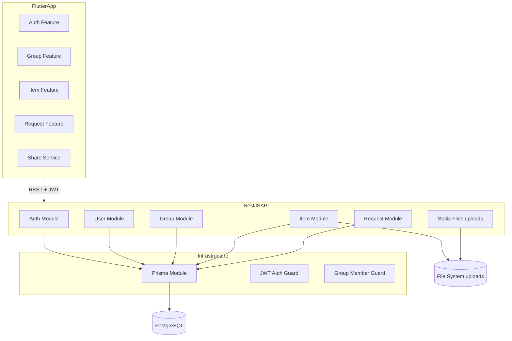
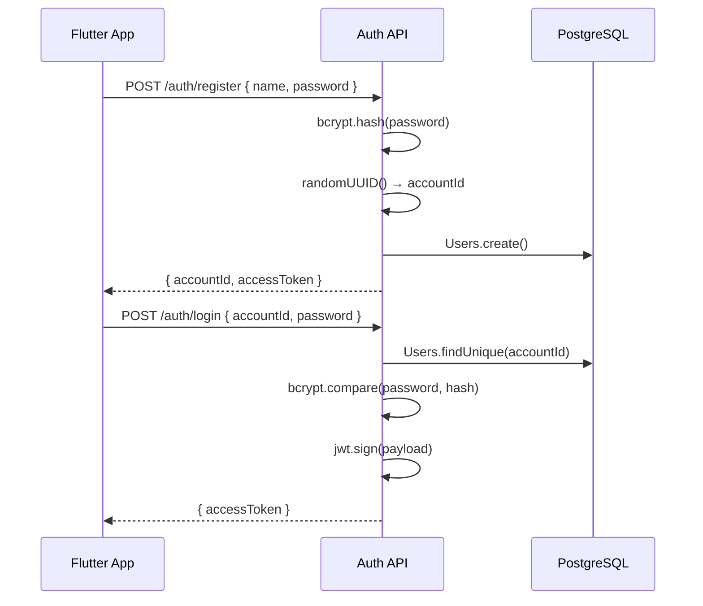
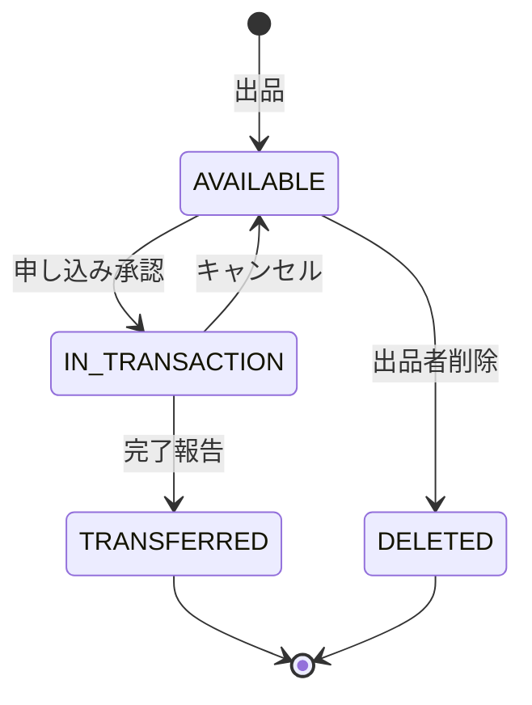
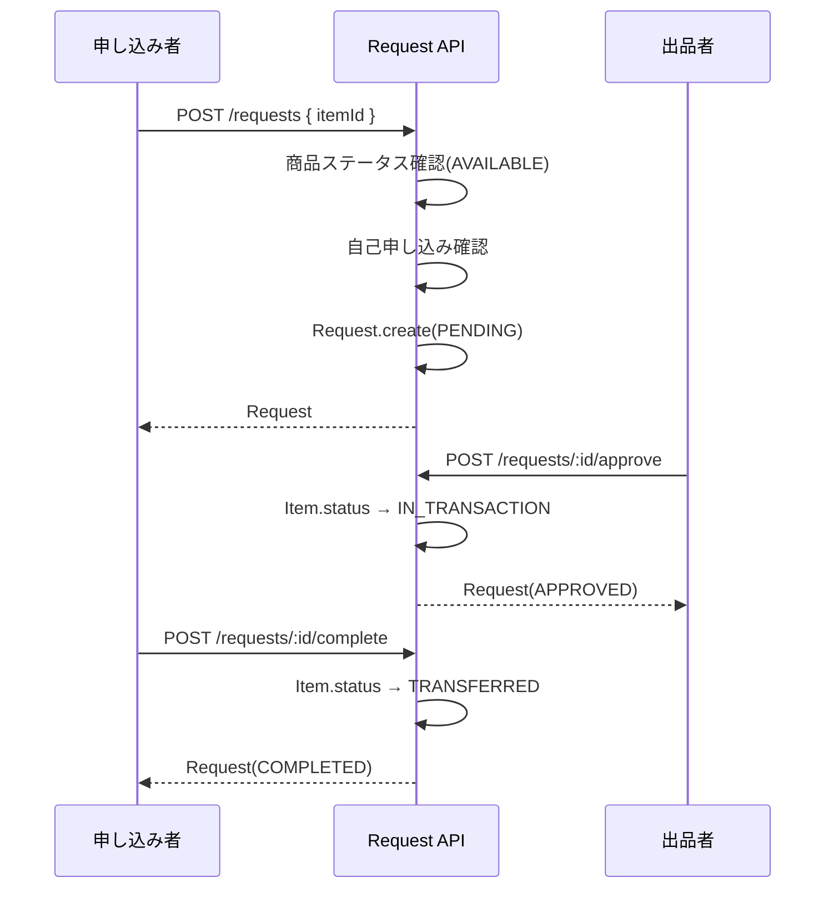
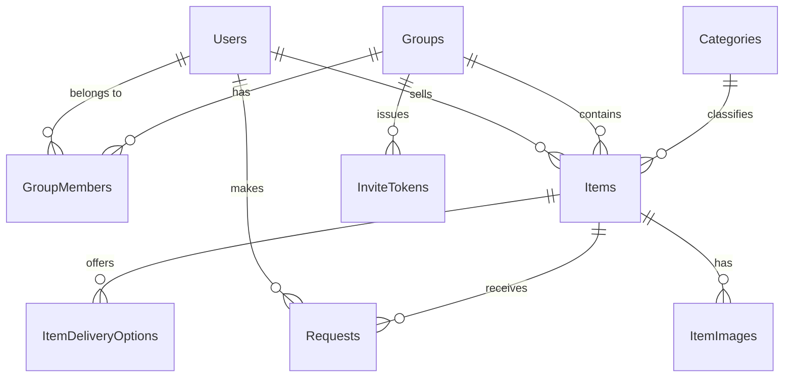

# 技術設計書: Family Marketplace

## Overview

**Purpose**: Family Marketplace は、家族・親戚間限定のクローズドなフリマプラットフォームを提供する。招待制グループ内で不用品を出品し、申し込み→承認→完了の状態機械を通じて金銭取引なしで物品を譲渡する。

**Users**: 家族・親戚（出品者・申し込み者）が Flutter モバイルアプリ（iOS/Android）を介して利用する。

**Impact**: 既存の User ドメインスキャフォールド上に Group / Item / Request の3ドメインを追加し、Prisma スキーマを全面再設計する。Flutter フロントエンドはゼロから実装する。

### Goals

- accountId（UUID, システム生成）+ password による JWT 認証を実装する
- 招待トークンによるクローズドグループ参加を実装する
- 商品出品・閲覧・検索（グループスコープ）を実装する
- 取引申し込み→承認/辞退→完了のステートマシンを実装する
- OS シェアシートによる商品情報外部シェアを実装する

### Non-Goals

- 金銭決済・価格管理
- アプリ内チャット・コメント
- プッシュ通知（FCM 連携）— 後続フェーズ
- グループメンバー削除・管理
- 商品カテゴリ管理 UI（初期はシードデータ固定）

---

## Architecture

### Existing Architecture Analysis

| 既存要素 | 状態 | 対応方針 |
|---|---|---|
| `UserModule` | 定義済み・`AppModule` 未登録 | `AppModule` に登録し修正 |
| `UserCommandRepository.signIn()` | `void` 返却（IF と不一致） | `UserEntity` 返却に修正 |
| `UserEntity.email` | 要件上不要 | フィールド削除 |
| Prisma `Users` | `email` 必須・`Favorite` あり | 全面再設計 |
| Prisma `Items` | 価格あり・`status`/`groupId` なし | 再設計 |
| Flutter `lib/main.dart` | デフォルトカウンタアプリ | 全面実装 |

### Architecture Pattern & Boundary Map



**Architecture Integration**:
- **バックエンド**: 既存の DDD + CQRS パターンを踏襲。ドメインごとにモジュール分割し、Command/Query リポジトリを分離する
- **フロントエンド**: Feature-first 構成 + Riverpod 状態管理。各 Feature は Screen / Provider / Repository を持つ
- **境界**: グループスコープのアクセス制御を `GroupMemberGuard` で横断的に適用する

### Technology Stack

| Layer | Choice / Version | Role | Notes |
|-------|-----------------|------|-------|
| Backend Framework | NestJS 11 | REST API、DI、モジュール管理 | 既存 |
| Language | TypeScript 5.7+ | 型安全な実装 | 既存 |
| ORM | Prisma 7 | DB アクセス、スキーマ管理 | 既存 |
| DB | PostgreSQL 16 | データ永続化 | 既存 |
| Auth | @nestjs/passport + passport-jwt + @nestjs/jwt | JWT 発行・検証 | 新規追加 |
| Password Hash | bcryptjs | パスワードハッシュ化 | 新規追加 |
| File Upload | @nestjs/platform-express (multer) | 画像アップロード | 新規追加 |
| Frontend | Flutter / Dart ^3.10.1 | iOS/Android モバイルアプリ | 既存 |
| State Management | flutter_riverpod 2.x | 型安全な状態管理 | 新規追加 |
| HTTP Client | dio | JWT インターセプター付き HTTP | 新規追加 |
| Secure Storage | flutter_secure_storage | JWT のセキュア保存 | 新規追加 |
| Image Picker | image_picker | カメラ・ギャラリーアクセス | 新規追加 |
| Share | share_plus | OS シェアシート呼び出し | 新規追加 |
| Routing | go_router | 宣言的ルーティング | 新規追加 |
| Infrastructure | Docker Compose | DB + バックエンド + ファイル永続化 | 既存（volumes 追加） |

---

## System Flows

### 1. 認証フロー



### 2. 取引申し込み・承認ステートマシン



### 3. 商品申し込みフロー



---

## Requirements Traceability

| 要件 | Summary | Components | Interfaces | Flows |
|------|---------|------------|------------|-------|
| 1.1 | 名前+パスワードで登録、accountId 取得 | AuthModule, UserModule | POST /auth/register | 認証フロー |
| 1.2 | accountId+パスワードでログイン | AuthModule | POST /auth/login | 認証フロー |
| 1.3 | 認証失敗時 401 | AuthModule | POST /auth/login | — |
| 1.4 | accountId はシステム自動生成 | AuthModule, UserEntity | — | — |
| 1.5 | グループ作成・オーナー登録 | GroupModule | POST /groups | — |
| 1.6 | 招待トークン発行 | GroupModule | POST /groups/:id/invite | — |
| 1.7 | 招待トークンでグループ参加 | GroupModule | POST /groups/join | — |
| 1.8 | 期限切れトークン 400 | GroupModule | POST /groups/join | — |
| 1.9 | 未認証リクエスト 401 | JwtAuthGuard | — | — |
| 2.1 | 商品出品（タイトル・説明・カテゴリ・渡し方） | ItemModule | POST /items | — |
| 2.2 | 渡し方オプション保存 | ItemModule | POST /items | — |
| 2.3 | 画像アップロード | ItemModule | POST /items/:id/images | — |
| 2.4 | 出品情報更新 | ItemModule | PATCH /items/:id | — |
| 2.5 | 他者の編集・削除 403 | ItemModule, ItemOwnerGuard | — | — |
| 2.6 | 出品削除（論理削除） | ItemModule | DELETE /items/:id | — |
| 2.7 | バリデーション 400 | ItemModule | POST/PATCH /items | — |
| 3.1 | グループスコープの商品一覧 | ItemModule | GET /items | — |
| 3.2 | 商品詳細取得 | ItemModule | GET /items/:id | — |
| 3.3 | キーワード検索 | ItemModule | GET /items?keyword= | — |
| 3.4 | カテゴリフィルタ | ItemModule | GET /items?categoryId= | — |
| 3.5 | ページネーション（max 50） | ItemModule | GET /items?offset=&limit= | — |
| 3.6 | 存在しない商品 404 | ItemModule | GET /items/:id | — |
| 4.1 | 申し込み登録 | RequestModule | POST /requests | 申し込みフロー |
| 4.2 | 自己申し込み 400 | RequestModule | POST /requests | — |
| 4.3 | 取引中・譲渡済み商品 409 | RequestModule | POST /requests | — |
| 4.4 | 承認 → IN_TRANSACTION | RequestModule | POST /requests/:id/approve | ステートマシン |
| 4.5 | 辞退 → DECLINED | RequestModule | POST /requests/:id/decline | — |
| 4.6 | 取引中は新規申し込み不可 | RequestModule | POST /requests | — |
| 4.7 | キャンセル → AVAILABLE | RequestModule | POST /requests/:id/cancel | ステートマシン |
| 5.1 | 完了報告 → TRANSFERRED | RequestModule | POST /requests/:id/complete | ステートマシン |
| 5.2 | 取引履歴取得 | RequestModule | GET /requests/history | — |
| 5.3 | TRANSFERRED 商品は一覧非表示 | ItemModule | GET /items | — |
| 5.4 | 非関与者の取引詳細 403 | RequestModule | GET /requests/:id | — |
| 6.1 | シェアボタン → シェアシート | ShareService (Flutter) | — | — |
| 6.2 | シェアテキストフォーマット | ShareService (Flutter) | — | — |
| 6.3 | OS シェアシート（LINE等） | ShareService (Flutter) | — | — |
| 6.4 | 認証済みユーザーならシェア可 | ItemFeature (Flutter) | — | — |
| 7.1 | iOS/Android 両対応 | Flutter App | — | — |
| 7.2 | 起動時トークンチェック | AuthProvider (Flutter) | — | — |
| 7.3 | JWT セキュアストレージ保存 | AuthRepository (Flutter) | — | — |
| 7.4 | accountId+パスワードのログイン UI | AuthScreen (Flutter) | — | — |
| 7.5 | 無限スクロール | ItemListScreen (Flutter) | — | — |
| 7.6 | 画像追加（カメラ/ギャラリー） | ItemCreateScreen (Flutter) | — | — |
| 7.7 | 渡し方複数選択 UI | ItemCreateScreen (Flutter) | — | — |
| 7.8 | API エラー表示 + 再試行 | 全 Screen (Flutter) | — | — |
| 7.9 | ローディングインジケーター | 全 Screen (Flutter) | — | — |

---

## Components and Interfaces

### コンポーネントサマリー

| Component | Layer | Intent | 要件 | Key Dependencies |
|-----------|-------|--------|------|-----------------|
| AuthModule | BE / Auth | 登録・ログイン・JWT発行 | 1.1–1.4, 1.9 | UserModule, @nestjs/jwt (P0) |
| UserModule | BE / Domain | ユーザーエンティティ管理 | 1.1–1.4 | PrismaModule (P0) |
| GroupModule | BE / Domain | グループ管理・招待制御 | 1.5–1.8 | PrismaModule, JwtAuthGuard (P0) |
| ItemModule | BE / Domain | 商品CRUD・画像・検索 | 2.1–3.6 | PrismaModule, GroupMemberGuard (P0) |
| RequestModule | BE / Domain | 取引申し込みステートマシン | 4.1–5.4 | PrismaModule, ItemModule (P0) |
| JwtAuthGuard | BE / Infra | JWT 検証ガード | 1.9 | @nestjs/passport (P0) |
| GroupMemberGuard | BE / Infra | グループ所属検証ガード | 3.1, 5.4 | PrismaModule (P0) |
| AuthFeature | FE / Feature | ログイン・登録画面 | 7.2–7.4 | AuthRepository, go_router (P0) |
| ItemFeature | FE / Feature | 商品一覧・詳細・出品 | 7.5–7.7 | ItemRepository, Riverpod (P0) |
| RequestFeature | FE / Feature | 申し込み管理 | — | RequestRepository, Riverpod (P0) |
| ShareService | FE / Service | OS シェアシート | 6.1–6.4 | share_plus (P0) |

---

### Backend / Auth Domain

#### AuthModule

| Field | Detail |
|-------|--------|
| Intent | accountId + password による JWT 認証・新規登録を提供する |
| Requirements | 1.1, 1.2, 1.3, 1.4, 1.9 |

**Responsibilities & Constraints**
- `register`: 名前・パスワードを受け取り、UUID の accountId を生成してユーザーを作成し、JWT を返す
- `login`: accountId・パスワードを受け取り、bcrypt で検証し、JWT を返す
- パスワードは必ず bcrypt でハッシュ化してから永続化する（生パスワードの保存禁止）
- JWT ペイロード: `{ sub: userId, accountId }`

**Dependencies**
- Inbound: Flutter App — HTTP リクエスト (P0)
- Outbound: UserModule — ユーザー検索・作成 (P0)
- External: `@nestjs/jwt` — JWT 署名・検証 (P0), `bcryptjs` — パスワードハッシュ (P0)

**Contracts**: Service [x] / API [x]

##### Service Interface
```typescript
interface AuthService {
  register(dto: RegisterDto): Promise<AuthResponseDto>;
  login(dto: LoginDto): Promise<AuthResponseDto>;
  validateUser(accountId: string, password: string): Promise<UserEntity | null>;
}

interface RegisterDto {
  name: string;
  password: string;  // 8文字以上
}

interface LoginDto {
  accountId: string;
  password: string;
}

interface AuthResponseDto {
  accountId: string;
  accessToken: string;
}
```

##### API Contract
| Method | Endpoint | Request Body | Response | Errors |
|--------|----------|-------------|----------|--------|
| POST | /auth/register | `RegisterDto` | `AuthResponseDto` (201) | 400 (バリデーション失敗) |
| POST | /auth/login | `LoginDto` | `AuthResponseDto` (200) | 401 (認証失敗) |

**Implementation Notes**
- JWT シークレットは環境変数 `JWT_SECRET` から取得する
- アクセストークン有効期限: `7d`（Refresh Token なし）
- `JwtAuthGuard` を `APP_GUARD` としてグローバル登録し、`@Public()` デコレータで認証スキップ対象を指定する

---

### Backend / Group Domain

#### GroupModule

| Field | Detail |
|-------|--------|
| Intent | 招待制グループの作成・参加・招待トークン発行を管理する |
| Requirements | 1.5, 1.6, 1.7, 1.8 |

**Responsibilities & Constraints**
- グループ作成時に作成者をオーナーかつ最初のメンバーとして登録する
- 招待トークンは UUID で生成し、有効期限（48時間）を設ける
- 既に参加済みのユーザーが同一グループの招待トークンを使用した場合は 409 を返す

**Dependencies**
- Inbound: Flutter App (P0)
- Outbound: PrismaModule — DB 永続化 (P0)
- Cross: JwtAuthGuard — 認証確認 (P0)

**Contracts**: Service [x] / API [x]

##### Service Interface
```typescript
interface GroupService {
  createGroup(userId: number, dto: CreateGroupDto): Promise<GroupDto>;
  generateInviteToken(ownerId: number, groupId: number): Promise<InviteTokenDto>;
  joinGroup(userId: number, dto: JoinGroupDto): Promise<GroupMemberDto>;
  getUserGroups(userId: number): Promise<GroupDto[]>;
}

interface CreateGroupDto { name: string; }
interface JoinGroupDto { token: string; }
interface InviteTokenDto { token: string; expiresAt: Date; }
interface GroupDto { id: number; name: string; ownerId: number; createdAt: Date; }
interface GroupMemberDto { groupId: number; userId: number; joinedAt: Date; }
```

##### API Contract
| Method | Endpoint | Request | Response | Errors |
|--------|----------|---------|----------|--------|
| POST | /groups | `CreateGroupDto` | `GroupDto` (201) | 400 |
| POST | /groups/:id/invite | — | `InviteTokenDto` (201) | 403 (非オーナー) |
| POST | /groups/join | `JoinGroupDto` | `GroupMemberDto` (200) | 400 (無効トークン), 409 (重複) |
| GET | /groups/mine | — | `GroupDto[]` (200) | — |

---

### Backend / Item Domain

#### ItemModule

| Field | Detail |
|-------|--------|
| Intent | 商品の CRUD・画像アップロード・グループスコープ検索を管理する |
| Requirements | 2.1–2.7, 3.1–3.6 |

**Responsibilities & Constraints**
- 商品は必ずグループに紐付く。グループメンバーのみがアクセス可能
- 削除は論理削除（`status: DELETED`）とし、物理削除は行わない
- 画像は `multer` でローカル保存し、URL（`/uploads/items/{uuid}.{ext}`）を DB に保存する
- 渡し方は `ItemDeliveryOptions` テーブルで管理し、複数選択可

**Dependencies**
- Inbound: Flutter App (P0)
- Outbound: PrismaModule (P0), ファイルシステム (P1)
- Cross: JwtAuthGuard (P0), GroupMemberGuard (P0), ItemOwnerGuard (P1)

**Contracts**: Service [x] / API [x]

##### Service Interface
```typescript
interface ItemService {
  createItem(sellerId: number, dto: CreateItemDto): Promise<ItemDetailDto>;
  uploadImage(itemId: number, sellerId: number, file: Express.Multer.File): Promise<ItemImageDto>;
  updateItem(itemId: number, sellerId: number, dto: UpdateItemDto): Promise<ItemDetailDto>;
  deleteItem(itemId: number, sellerId: number): Promise<void>;
  getItems(userId: number, query: ItemQueryDto): Promise<PaginatedItemsDto>;
  getItemById(itemId: number, userId: number): Promise<ItemDetailDto>;
}

interface CreateItemDto {
  title: string;            // max 200文字
  description?: string;
  categoryId: number;
  groupId: number;
  deliveryMethods: DeliveryMethod[];  // min 1件
}

interface UpdateItemDto {
  title?: string;
  description?: string;
  categoryId?: number;
  deliveryMethods?: DeliveryMethod[];
}

interface ItemQueryDto {
  groupId: number;
  keyword?: string;
  categoryId?: number;
  offset?: number;   // default: 0
  limit?: number;    // default: 20, max: 50
}

type DeliveryMethod = 'HAND_DELIVERY' | 'POSTAL' | 'COURIER' | 'OTHER';

interface ItemDetailDto {
  id: number;
  title: string;
  description: string | null;
  category: CategoryDto;
  seller: UserSummaryDto;
  status: ItemStatus;
  deliveryMethods: DeliveryMethod[];
  images: ItemImageDto[];
  createdAt: Date;
}

interface PaginatedItemsDto {
  items: ItemDetailDto[];
  total: number;
  offset: number;
  limit: number;
}

interface ItemImageDto { id: number; imageUrl: string; order: number; }
```

##### API Contract
| Method | Endpoint | Request | Response | Errors |
|--------|----------|---------|----------|--------|
| GET | /items | `ItemQueryDto` (query) | `PaginatedItemsDto` (200) | 403 (非メンバー) |
| GET | /items/:id | — | `ItemDetailDto` (200) | 404, 403 |
| POST | /items | `CreateItemDto` | `ItemDetailDto` (201) | 400 |
| POST | /items/:id/images | multipart/form-data | `ItemImageDto` (201) | 403, 400 (5MB超) |
| PATCH | /items/:id | `UpdateItemDto` | `ItemDetailDto` (200) | 403, 400, 404 |
| DELETE | /items/:id | — | 204 | 403, 404 |

---

### Backend / Request Domain

#### RequestModule

| Field | Detail |
|-------|--------|
| Intent | 取引申し込みの作成・ステータス遷移を管理する |
| Requirements | 4.1–4.7, 5.1–5.4 |

**Responsibilities & Constraints**
- 取引ステートマシンに従い、不正な遷移（例: TRANSFERRED → APPROVED）を拒否する
- 商品が `AVAILABLE` でない場合の申し込みは 409 で拒否する
- `IN_TRANSACTION` 中に別ユーザーが申し込んだ場合も 409 で拒否する
- `approve` 時は DB トランザクションで `Item.status` 更新と `Request.status` 更新を原子的に実行する

**Dependencies**
- Inbound: Flutter App (P0)
- Outbound: PrismaModule (P0)
- Cross: ItemModule — 商品ステータス確認 (P0), JwtAuthGuard (P0)

**Contracts**: Service [x] / API [x]

##### Service Interface
```typescript
interface RequestService {
  createRequest(requesterId: number, dto: CreateRequestDto): Promise<RequestDto>;
  approveRequest(requestId: number, sellerId: number): Promise<RequestDto>;
  declineRequest(requestId: number, sellerId: number): Promise<RequestDto>;
  cancelRequest(requestId: number, userId: number): Promise<RequestDto>;
  completeRequest(requestId: number, requesterId: number): Promise<RequestDto>;
  getRequestsForItem(itemId: number, sellerId: number): Promise<RequestDto[]>;
  getMyRequests(userId: number): Promise<RequestDto[]>;
}

interface CreateRequestDto { itemId: number; }

interface RequestDto {
  id: number;
  itemId: number;
  requester: UserSummaryDto;
  status: RequestStatus;
  createdAt: Date;
  completedAt: Date | null;
}

type RequestStatus = 'PENDING' | 'APPROVED' | 'DECLINED' | 'CANCELLED' | 'COMPLETED';
```

##### API Contract
| Method | Endpoint | Request | Response | Errors |
|--------|----------|---------|----------|--------|
| POST | /requests | `CreateRequestDto` | `RequestDto` (201) | 400 (自己申込), 409 (状態不可) |
| GET | /requests?itemId=:id | — | `RequestDto[]` (200) | 403 |
| GET | /requests/my-requests | — | `RequestDto[]` (200) | — |
| GET | /requests/history | — | `RequestDto[]` (200) | — |
| POST | /requests/:id/approve | — | `RequestDto` (200) | 403, 409 |
| POST | /requests/:id/decline | — | `RequestDto` (200) | 403 |
| POST | /requests/:id/cancel | — | `RequestDto` (200) | 403 |
| POST | /requests/:id/complete | — | `RequestDto` (200) | 403 |

---

### Backend / Infrastructure

#### JwtAuthGuard

| Field | Detail |
|-------|--------|
| Intent | 全エンドポイントへの JWT 検証をグローバルに適用する |
| Requirements | 1.9 |

**Responsibilities & Constraints**
- `APP_GUARD` としてグローバル登録する
- `@Public()` デコレータ付きエンドポイント（`/auth/register`, `/auth/login`）はスキップする

#### GroupMemberGuard

| Field | Detail |
|-------|--------|
| Intent | リクエストしたユーザーが対象グループのメンバーであることを検証する |
| Requirements | 3.1, 5.4 |

**Responsibilities & Constraints**
- `groupId` をクエリパラメータまたはルートパラメータ（`/items/:id` 経由の商品のグループ）から取得し検証する

---

### Frontend / Features

#### AuthFeature

| Field | Detail |
|-------|--------|
| Intent | ログイン・登録画面と JWT 管理を担当する |
| Requirements | 7.2, 7.3, 7.4, 1.1, 1.2 |

**Contracts**: State [x]

##### State Management
```dart
// AuthState (Riverpod StateNotifier)
class AuthState {
  final bool isAuthenticated;
  final String? accountId;
  final String? accessToken;
  final bool isLoading;
  final String? errorMessage;
}

// AuthRepository
abstract class AuthRepository {
  Future<AuthResponse> register(String name, String password);
  Future<AuthResponse> login(String accountId, String password);
  Future<void> logout();
  Future<String?> getStoredToken();
}
```

**Implementation Notes**
- `flutter_secure_storage` で `accessToken` を保存する
- `go_router` の `redirect` で未認証時にログイン画面へリダイレクトする
- `dio` インターセプターで全リクエストに `Authorization: Bearer {token}` を付与する

#### ItemFeature

| Field | Detail |
|-------|--------|
| Intent | 商品一覧・詳細・出品・編集画面を担当する |
| Requirements | 7.5, 7.6, 7.7, 3.1–3.6, 2.1–2.4 |

**Contracts**: State [x]

##### State Management
```dart
class ItemListState {
  final List<ItemSummary> items;
  final bool isLoading;
  final bool hasMore;
  final int offset;
  final String? keyword;
  final int? categoryId;
}

class ItemDetailState {
  final ItemDetail? item;
  final bool isLoading;
  final String? errorMessage;
}
```

**Implementation Notes**
- 無限スクロール: `ScrollController` + `offset` インクリメントで次ページ取得
- 画像選択: `image_picker` の `pickImage()` で選択後、`MultipartFile` として送信

#### ShareService

| Field | Detail |
|-------|--------|
| Intent | 商品情報を OS シェアシート経由で外部アプリへシェアする |
| Requirements | 6.1, 6.2, 6.3, 6.4 |

**Contracts**: Service [x]

##### Service Interface
```dart
class ShareService {
  void shareItem(ItemDetail item) {
    final text = '【Family Marketplace】${item.title}\n'
        '${item.description ?? ""}\n'
        '渡し方: ${item.deliveryMethods.join(", ")}\n'
        '出品者: ${item.seller.name}';
    Share.share(text);
  }
}
```

---

## Data Models

### Domain Model

**集約とトランザクション境界**:
- **User 集約**: `Users`（ルート）→ 認証・プロフィール
- **Group 集約**: `Groups`（ルート）→ `GroupMembers`, `InviteTokens`
- **Item 集約**: `Items`（ルート）→ `ItemImages`, `ItemDeliveryOptions`
- **Request 集約**: `Requests`（ルート）→ ステータス遷移

**不変条件**:
- Item の `status` は定義されたステートマシン遷移のみ許可
- Request の作成は `Item.status == AVAILABLE` かつ `requesterId != item.sellerId` のときのみ
- `GroupMembers` に `@@unique([groupId, userId])` 制約

### Logical Data Model



### Physical Data Model

**Prisma Schema（新規）**:

```prisma
enum ItemStatus {
  AVAILABLE
  IN_TRANSACTION
  TRANSFERRED
  DELETED
}

enum DeliveryMethod {
  HAND_DELIVERY
  POSTAL
  COURIER
  OTHER
}

enum RequestStatus {
  PENDING
  APPROVED
  DECLINED
  CANCELLED
  COMPLETED
}

model Users {
  id           Int      @id @default(autoincrement())
  accountId    String   @unique  // UUID, システム自動生成
  name         String
  passwordHash String
  createdAt    DateTime @default(now())
  updatedAt    DateTime @updatedAt

  ownedGroups  Groups[]       @relation("GroupOwner")
  groupMembers GroupMembers[]
  listedItems  Items[]        @relation("ItemSeller")
  requests     Requests[]
}

model Groups {
  id        Int      @id @default(autoincrement())
  name      String
  ownerId   Int
  createdAt DateTime @default(now())

  owner   Users          @relation("GroupOwner", fields: [ownerId], references: [id])
  members GroupMembers[]
  invites InviteTokens[]
  items   Items[]
}

model GroupMembers {
  id       Int      @id @default(autoincrement())
  groupId  Int
  userId   Int
  joinedAt DateTime @default(now())

  group Groups @relation(fields: [groupId], references: [id])
  user  Users  @relation(fields: [userId], references: [id])

  @@unique([groupId, userId])
}

model InviteTokens {
  id        Int       @id @default(autoincrement())
  groupId   Int
  token     String    @unique
  expiresAt DateTime
  usedAt    DateTime?

  group Groups @relation(fields: [groupId], references: [id])
}

model Categories {
  id    Int     @id @default(autoincrement())
  name  String  @unique
  items Items[]
}

model Items {
  id          Int        @id @default(autoincrement())
  title       String
  description String?
  sellerId    Int
  groupId     Int
  categoryId  Int
  status      ItemStatus @default(AVAILABLE)
  createdAt   DateTime   @default(now())
  updatedAt   DateTime   @updatedAt

  seller          Users               @relation("ItemSeller", fields: [sellerId], references: [id])
  group           Groups              @relation(fields: [groupId], references: [id])
  category        Categories          @relation(fields: [categoryId], references: [id])
  images          ItemImages[]
  deliveryOptions ItemDeliveryOptions[]
  requests        Requests[]
}

model ItemImages {
  id       Int    @id @default(autoincrement())
  itemId   Int
  imageUrl String
  order    Int    @default(0)

  item Items @relation(fields: [itemId], references: [id])
}

model ItemDeliveryOptions {
  id     Int            @id @default(autoincrement())
  itemId Int
  method DeliveryMethod

  item Items @relation(fields: [itemId], references: [id])

  @@unique([itemId, method])
}

model Requests {
  id          Int           @id @default(autoincrement())
  itemId      Int
  requesterId Int
  status      RequestStatus @default(PENDING)
  createdAt   DateTime      @default(now())
  updatedAt   DateTime      @updatedAt
  completedAt DateTime?

  item      Items @relation(fields: [itemId], references: [id])
  requester Users @relation(fields: [requesterId], references: [id])
}
```

### Data Contracts & Integration

**シリアライゼーション**: JSON (UTF-8)

**日付フォーマット**: ISO 8601 (`2026-03-27T00:00:00.000Z`)

**画像 URL**: `http://{host}/uploads/items/{uuid}.{ext}` — サーバーが静的配信

---

## Error Handling

### Error Strategy

バックエンドは NestJS 標準の `HttpException` を使用し、構造化されたエラーレスポンスを返す。

```typescript
// 標準エラーレスポンス形式
{
  statusCode: number;
  message: string;  // ユーザー向けメッセージ（日本語）
  error: string;    // HTTP ステータステキスト
}
```

### Error Categories and Responses

**User Errors (4xx)**:
| Status | ケース | message |
|--------|--------|---------|
| 400 | バリデーション失敗 | フィールドレベルのエラー詳細 |
| 400 | 自己申し込み | 「自分の出品には申し込みできません」 |
| 400 | 無効招待トークン | 「招待リンクが無効または期限切れです」 |
| 401 | 認証失敗 | 「アカウントIDまたはパスワードが正しくありません」 |
| 401 | トークン未提供・無効 | 「認証が必要です」 |
| 403 | 権限なし | 「この操作を行う権限がありません」 |
| 404 | リソース未存在 | 「商品が見つかりません」 |
| 409 | 状態競合 | 「この商品はすでに取引中または譲渡済みです」 |

**System Errors (5xx)**:
- DB 接続エラー → 503、ログ出力
- ファイル書き込み失敗 → 500、ロールバック（DB レコード不作成）

**Flutter エラーハンドリング**:
- `dio` のレスポンスインターセプターで `message` フィールドを抽出してスナックバー表示
- ネットワーク未接続は `DioException.connectionTimeout` でキャッチし「接続を確認してください」を表示

### Monitoring

- NestJS デフォルトロガーで全 4xx/5xx をコンソール出力（`[ERROR]` プレフィックス）
- Prisma クエリログは開発環境のみ有効化

---

## Testing Strategy

### Unit Tests（バックエンド）

- `AuthService`: `register()` の accountId 生成、`login()` の bcrypt 検証、JWT 発行
- `GroupService`: 招待トークン有効期限検証、重複参加の拒否
- `ItemService`: バリデーション（タイトル長・渡し方必須）、論理削除
- `RequestService`: ステートマシン遷移（正常・異常系）、自己申し込み拒否、取引中商品への申し込み拒否

### Integration Tests（バックエンド）

- `POST /auth/register` → accountId 返却・DB 確認
- `POST /auth/login` → JWT 返却
- `POST /items` → 商品作成・画像 URL 確認
- `POST /requests` → 申し込み→承認→完了の E2E フロー
- `GroupMemberGuard` → グループ外ユーザーが 403 を受け取ること

### Flutter Widget Tests

- `LoginScreen`: フォーム入力・送信・エラー表示
- `ItemListScreen`: ローディング・無限スクロール・エラー再試行
- `ItemCreateScreen`: 渡し方チェックボックス選択・バリデーション

### Flutter Integration Tests

- ログイン → 商品一覧 → 商品詳細 → シェア のフロー

---

## Security Considerations

- **パスワードハッシュ**: bcrypt、saltRounds=10
- **JWT シークレット**: 環境変数 `JWT_SECRET`（最小 32 文字のランダム文字列）。コードにハードコード禁止
- **グループスコープ強制**: `GroupMemberGuard` を全商品・申し込みエンドポイントに適用する。ガード省略は禁止
- **ファイルアップロード**: `multer` で MIME タイプ（`image/jpeg`, `image/png`, `image/webp`）と最大サイズ（5MB）を検証する
- **accountId の推測困難性**: UUID v4 はランダム生成のため推測不可

---

## Migration Strategy

既存の Prisma スキーマ（`Users`/`Items`/`Favorite`）は本設計と非互換のため、以下の手順で移行する。

1. `schema.prisma` を本設計の新スキーマに置き換える
2. `npx prisma migrate dev --name initial-family-marketplace` でマイグレーション生成
3. カテゴリのシードデータ（家電・衣類・書籍・おもちゃ・その他）を `prisma/seed.ts` で投入する
4. `docker compose down -v && docker compose up -d` で DB を再作成する（開発初期段階のため既存データ破棄を許容）
