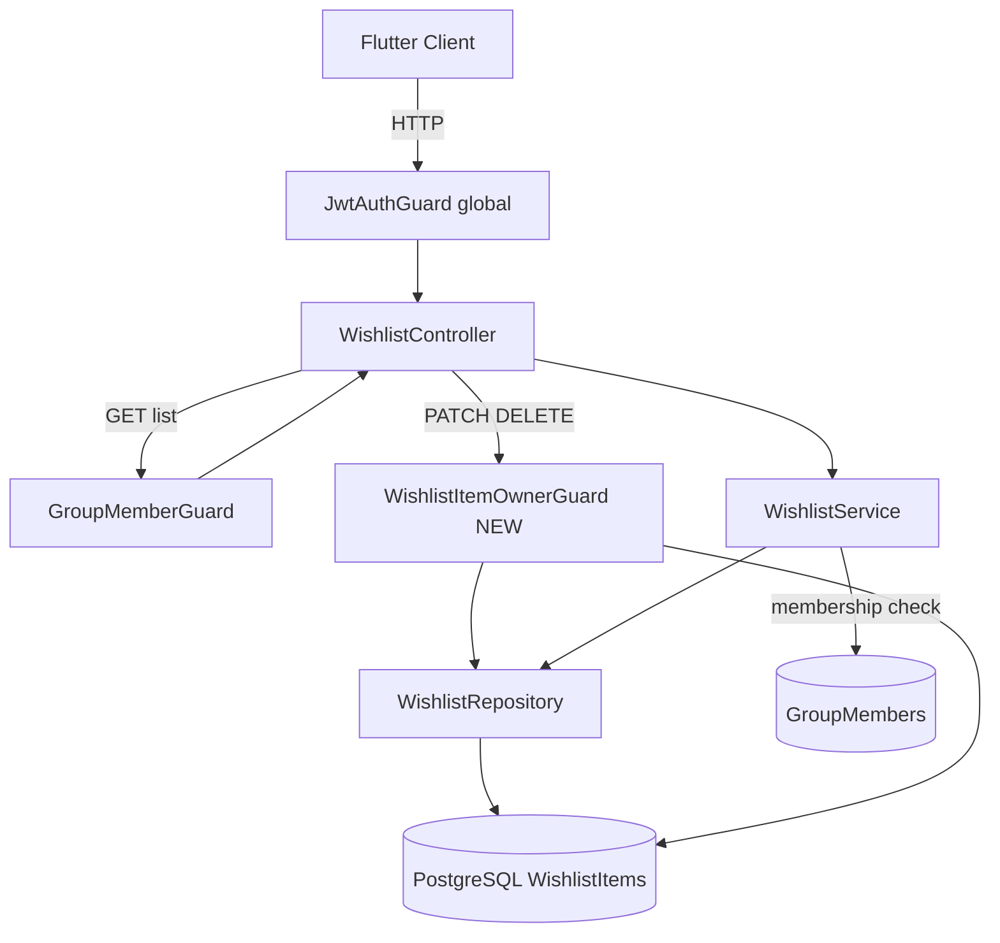
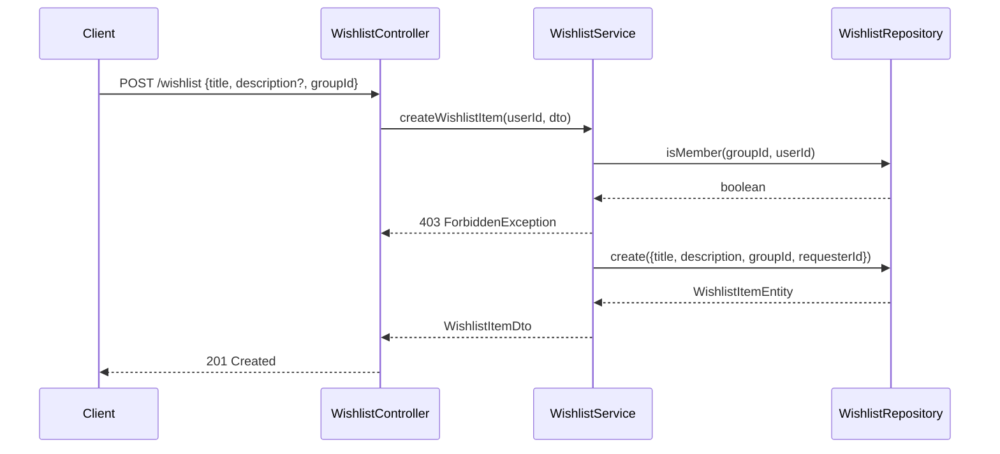
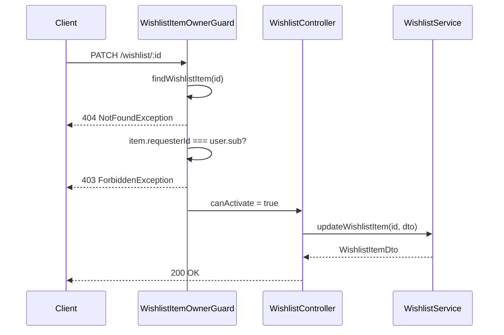

# 技術設計書: item-wishlist

## Overview

グループメンバーが「まだ出品されていないアイテム」を欲しいと表明するウィッシュリスト機能を提供する。既存の `request` ドメイン（出品済みアイテムへの譲渡申請）とは独立した新ドメイン `wishlist` として実装する。

**Purpose**: グループ内メンバーが欲しいアイテムを事前に投稿しておくことで、他のメンバーが出品するきっかけを提供する。
**Users**: 認証済みのグループメンバー全員が投稿・閲覧・自分の投稿の編集／削除を行う。
**Impact**: 新ドメイン追加のみ。既存テーブル・ドメインへの変更なし。Prismaスキーマに `WishlistItems` テーブルを追加する。

### Goals

- グループ内限定でウィッシュリストを投稿・閲覧できる
- 投稿者自身のみが編集・削除できる
- 既存アーキテクチャパターン（DDD、Repository、Guard）に準拠する

### Non-Goals

- 出品済みアイテムとのマッチング機能
- ウィッシュリストへの「提供できます」リアクション機能
- ウィッシュリスト投稿からの直接出品フロー
- 画像添付

---

## Architecture

### Existing Architecture Analysis

既存のドメイン（`favorite`, `item`）はすべて以下のレイヤー構成を持つ:

```
domains/{domain}/
├── {domain}.module.ts        # NestJSモジュール・DI設定
├── controller/               # HTTPエンドポイント + DTO
├── service/                  # ユースケース・ビジネスロジック
├── domain/
│   ├── entity.ts             # ドメインエンティティ（不変クラス）
│   └── interfaces/           # リポジトリインターフェース
└── infra/                    # Prismaリポジトリ実装
```

共通ガード（`common/guards/`）はコントローラーデコレータで適用される:
- `GroupMemberGuard` — クエリパラメータ `groupId` ベースのメンバーシップ確認
- `ItemOwnerGuard` — アイテム所有者確認

### Architecture Pattern & Boundary Map



**Architecture Integration**:
- Selected pattern: DDD レイヤードアーキテクチャ（既存パターンの踏襲）
- Domain boundary: `wishlist` ドメインは `group` / `user` ドメインへの依存はPrisma経由のみ
- Existing patterns preserved: 単一リポジトリIF・`@Inject('TOKEN')` DI・class-validator DTO
- New components: `WishlistItemOwnerGuard`（`common/guards/` に追加）
- Steering compliance: 全ファイルの命名・レイヤー構成はsteering `structure.md` に準拠

### Technology Stack

| Layer | Choice / Version | Role | Notes |
|-------|-----------------|------|-------|
| Backend | NestJS 11 | HTTPエンドポイント・DI | 変更なし |
| ORM | Prisma 7 | WishlistItemsモデル追加 | `schema.prisma` 拡張 + migration |
| DB | PostgreSQL 16 | `wishlist_items` テーブル | 既存DBに追加 |
| Validation | class-validator / class-transformer | DTO検証 | 変更なし |
| Auth | JWT + Passport | グローバルJWTガード流用 | 変更なし |

---

## System Flows

### 投稿フロー



### 編集・削除フロー（WishlistItemOwnerGuard）



---

## Requirements Traceability

| Requirement | Summary | Components | Interfaces | Flows |
|-------------|---------|------------|------------|-------|
| 1.1–1.6 | ウィッシュリスト投稿 | WishlistController, WishlistService, WishlistRepository | POST /wishlist | 投稿フロー |
| 2.1–2.4 | ウィッシュリスト一覧 | WishlistController, WishlistService, WishlistRepository | GET /wishlist?groupId | — |
| 3.1–3.3 | ウィッシュリスト詳細 | WishlistController, WishlistService, WishlistRepository | GET /wishlist/:id | — |
| 4.1–4.3 | 編集 | WishlistController, WishlistService, WishlistItemOwnerGuard | PATCH /wishlist/:id | 編集フロー |
| 5.1–5.3 | 削除 | WishlistController, WishlistService, WishlistItemOwnerGuard | DELETE /wishlist/:id | 削除フロー |

---

## Components and Interfaces

| Component | Domain/Layer | Intent | Req Coverage | Key Dependencies | Contracts |
|-----------|-------------|--------|-------------|-----------------|-----------|
| WishlistController | Controller | HTTPエンドポイント | 1–5 | WishlistService (P0), GroupMemberGuard (P1), WishlistItemOwnerGuard (P1) | API |
| WishlistService | Service | ユースケース・認可補完 | 1–5 | IWishlistRepository (P0) | Service |
| WishlistRepository | Infra | Prismaによる永続化 | 1–5 | PrismaService (P0) | — |
| WishlistItemOwnerGuard | Common/Guards | 投稿者のみ編集・削除を許可 | 4, 5 | PrismaService (P0) | — |
| WishlistModule | Module | DI設定 | — | PrismaModule (P0) | — |

---

### Controller Layer

#### WishlistController

| Field | Detail |
|-------|--------|
| Intent | ウィッシュリストの CRUD エンドポイントを提供する |
| Requirements | 1.1–1.6, 2.1–2.4, 3.1–3.3, 4.1–4.3, 5.1–5.3 |

**Responsibilities & Constraints**
- HTTP リクエストの受付・レスポンス整形のみ。ビジネスロジックを持たない
- 認可は `GroupMemberGuard` および `WishlistItemOwnerGuard` に委譲
- グローバル `JwtAuthGuard` により全エンドポイントで認証を要求

**Dependencies**
- Inbound: Flutter Client — HTTPリクエスト (P0)
- Outbound: WishlistService — ユースケース実行 (P0)
- Outbound: GroupMemberGuard — グループメンバーシップ確認 (P1)
- Outbound: WishlistItemOwnerGuard — 投稿者確認 (P1)

**Contracts**: API [x]

##### API Contract

| Method | Endpoint | Request | Response | Errors |
|--------|----------|---------|----------|--------|
| POST | /wishlist | `CreateWishlistItemDto` | `WishlistItemDto` (201) | 400, 403, 500 |
| GET | /wishlist?groupId=:id | — | `WishlistItemDto[]` (200) | 403, 500 |
| GET | /wishlist/:id | — | `WishlistItemDto` (200) | 403, 404, 500 |
| PATCH | /wishlist/:id | `UpdateWishlistItemDto` | `WishlistItemDto` (200) | 400, 403, 404, 500 |
| DELETE | /wishlist/:id | — | (204) | 403, 404, 500 |

```typescript
// Controller DTOs (controller/dto/wishlist.dto.ts)
export class CreateWishlistItemDto {
  @IsString()
  @MaxLength(200)
  title: string;

  @IsOptional()
  @IsString()
  description?: string;

  @IsNumber()
  @Type(() => Number)
  groupId: number;
}

export class UpdateWishlistItemDto {
  @IsOptional()
  @IsString()
  @MaxLength(200)
  title?: string;

  @IsOptional()
  @IsString()
  description?: string;
}

// Response DTO (domain/dto/wishlist.dto.ts)
export interface WishlistItemDto {
  id: number;
  title: string;
  description: string | null;
  groupId: number;
  requesterId: number;
  requester: { id: number; accountId: string; name: string };
  createdAt: string;
  updatedAt: string;
}
```

**Implementation Notes**
- `GET /wishlist?groupId=:id` に `@UseGuards(GroupMemberGuard)` を適用
- `PATCH /wishlist/:id` と `DELETE /wishlist/:id` に `@UseGuards(WishlistItemOwnerGuard)` を適用
- `POST /wishlist` と `GET /wishlist/:id` のグループメンバーシップ確認はサービス層で実施（`GroupMemberGuard` はリクエストボディ・wishlistテーブル参照に非対応のため）

---

### Service Layer

#### WishlistService

| Field | Detail |
|-------|--------|
| Intent | ウィッシュリストのユースケースを実装し、必要な認可補完を行う |
| Requirements | 1.1–1.6, 2.1–2.4, 3.1–3.3, 4.1–4.3, 5.1–5.3 |

**Responsibilities & Constraints**
- `POST` および `GET /:id` のグループメンバーシップ確認をPrismaで実施
- リポジトリへの操作委譲
- ドメインエンティティ → DTOの変換

**Dependencies**
- Inbound: WishlistController (P0)
- Outbound: IWishlistRepository — 永続化 (P0)

**Contracts**: Service [x]

##### Service Interface

```typescript
interface WishlistServiceInterface {
  createWishlistItem(
    userId: number,
    dto: CreateWishlistItemDto,
  ): Promise<WishlistItemDto>;

  getWishlistItems(groupId: number): Promise<WishlistItemDto[]>;

  getWishlistItemById(id: number, userId: number): Promise<WishlistItemDto>;

  updateWishlistItem(
    id: number,
    dto: UpdateWishlistItemDto,
  ): Promise<WishlistItemDto>;

  deleteWishlistItem(id: number): Promise<void>;
}
```

- Preconditions: `createWishlistItem` — userがgroupIdのメンバーであること
- Preconditions: `getWishlistItemById` — userがwishlistItemのgroupIdのメンバーであること
- Postconditions: `deleteWishlistItem` — レコード削除済み
- Invariants: WishlistItemの `requesterId` は作成後変更不可

**Implementation Notes**
- グループメンバーシップ確認: `GroupMembersテーブル` を `findUnique({ where: { groupId_userId: ... } })` で確認
- メンバーでない場合 `ForbiddenException` をスロー（要件 1.6, 3.3）

---

### Infrastructure Layer

#### WishlistRepository

| Field | Detail |
|-------|--------|
| Intent | Prismaを使ってWishlistItemsテーブルのCRUD操作を提供する |
| Requirements | 1.1, 2.1, 3.1, 4.1, 5.1 |

**Dependencies**
- Inbound: WishlistService (P0)
- External: PrismaService (P0)

**Contracts**: Service [x]

##### Service Interface

```typescript
// domain/interfaces/wishlist.repository.interface.ts
export interface IWishlistRepository {
  create(data: {
    title: string;
    description?: string;
    groupId: number;
    requesterId: number;
  }): Promise<WishlistItemRaw>;

  findByGroupId(groupId: number): Promise<WishlistItemRaw[]>;

  findById(id: number): Promise<WishlistItemRaw | null>;

  update(
    id: number,
    data: { title?: string; description?: string },
  ): Promise<WishlistItemRaw>;

  delete(id: number): Promise<void>;
}

// ドメイン生データ型
export interface WishlistItemRaw {
  id: number;
  title: string;
  description: string | null;
  groupId: number;
  requesterId: number;
  requester: { id: number; accountId: string; name: string };
  createdAt: Date;
  updatedAt: Date;
}
```

**Implementation Notes**
- `findByGroupId`: `orderBy: { createdAt: 'desc' }` で新着順（要件 2.3）
- `requester` は `select: { id, accountId, name }` でinclude

---

### Common Guards

#### WishlistItemOwnerGuard

| Field | Detail |
|-------|--------|
| Intent | PATCH / DELETE の実行者がウィッシュリスト投稿者であることを確認する |
| Requirements | 4.2, 5.2, 5.3 |

**Responsibilities & Constraints**
- `params.id` でWishlistItemsをPK検索
- 存在しない場合 `NotFoundException`
- `requesterId !== user.sub` の場合 `ForbiddenException`
- `common/guards/wishlist-item-owner.guard.ts` として追加（`ItemOwnerGuard` と対称的な位置）

**Dependencies**
- External: PrismaService (P0) — wishlistItemsテーブルPK検索

```typescript
// common/guards/wishlist-item-owner.guard.ts
@Injectable()
export class WishlistItemOwnerGuard implements CanActivate {
  constructor(@Inject(PrismaService) private readonly prisma: PrismaService) {}

  async canActivate(context: ExecutionContext): Promise<boolean>;
  // params.id → wishlistItems findUnique
  // requesterId !== user.sub → ForbiddenException
}
```

---

## Data Models

### Domain Model

`WishlistItem` は `Group` にスコープされた投稿エンティティ。`requesterId` が集約ルートの所有者を示す。

- Aggregate root: `WishlistItem`
- Entities: `WishlistItem`（id, title, description, groupId, requesterId, createdAt, updatedAt）
- Invariants: `requesterId` は作成後変更不可。`title` は空文字不可（最大200字）
- Domain events: なし（現フェーズ）

### Logical Data Model

```
WishlistItems
  id          : Integer, PK, auto-increment
  title       : String(200), NOT NULL
  description : String, NULLABLE
  requesterId : Integer, FK → Users.id, NOT NULL
  groupId     : Integer, FK → Groups.id, NOT NULL
  createdAt   : DateTime, DEFAULT now()
  updatedAt   : DateTime, auto-update
```

- `requesterId` + `groupId` の複合インデックスを検討（グループ内ユーザーの投稿絞り込み用）
- 削除は物理削除（論理削除フラグなし）

### Physical Data Model

**Prisma Schema Addition**:

```prisma
model WishlistItems {
  id          Int      @id @default(autoincrement())
  title       String
  description String?
  requesterId Int
  groupId     Int
  createdAt   DateTime @default(now())
  updatedAt   DateTime @updatedAt

  requester Users  @relation("WishlistRequester", fields: [requesterId], references: [id])
  group     Groups @relation(fields: [groupId], references: [id])
}
```

`Users` モデルに `wishlistItems Users[] @relation("WishlistRequester")` を追加。
`Groups` モデルに `wishlistItems WishlistItems[]` を追加。

### Data Contracts & Integration

API レスポンスはJSON形式。`createdAt` / `updatedAt` はISO 8601文字列としてシリアライズ。

---

## Error Handling

### Error Strategy

バリデーションエラーはグローバル `ValidationPipe` が処理。ドメイン固有エラーはNestJS組み込みException（`NotFoundException`, `ForbiddenException`, `BadRequestException`）を使用する。

### Error Categories and Responses

| Category | Condition | Status | Exception |
|----------|-----------|--------|-----------|
| User Error | タイトル空・型不正 | 400 | `BadRequestException` |
| Unauthorized | JWT未付与 | 401 | GlobalJwtGuard |
| Forbidden | 非グループメンバー | 403 | `ForbiddenException` |
| Forbidden | 非投稿者による編集・削除 | 403 | `ForbiddenException` |
| Not Found | 存在しないID指定 | 404 | `NotFoundException` |
| Server Error | DB接続失敗等 | 500 | 未処理例外 |

### Monitoring

- 500エラーはNestJS標準ロギングで記録（既存設定流用）

---

## Testing Strategy

### Unit Tests

- `WishlistService.createWishlistItem`: グループ非メンバーで `ForbiddenException`、正常系でDTOを返す
- `WishlistService.getWishlistItemById`: 非メンバーで `ForbiddenException`、存在しないIDで `NotFoundException`
- `WishlistItemOwnerGuard.canActivate`: 非所有者で `ForbiddenException`、非存在IDで `NotFoundException`

### Integration Tests

- `POST /wishlist`: 正常系201・バリデーション400・非メンバー403
- `GET /wishlist?groupId=:id`: 正常系200・グループIDなし400
- `PATCH /wishlist/:id`: 所有者200・非所有者403・存在しないID 404
- `DELETE /wishlist/:id`: 所有者204・非所有者403

---

## Security Considerations

- 全エンドポイントはグローバル `JwtAuthGuard` で保護済み
- グループ外ユーザーからのアクセスを `GroupMemberGuard` / サービス層メンバーシップ確認でブロック
- 他ユーザーのウィッシュリストへの書き込みを `WishlistItemOwnerGuard` でブロック
- `description` に対してNestJSの `ValidationPipe(whitelist: true)` が未知フィールドを除去
