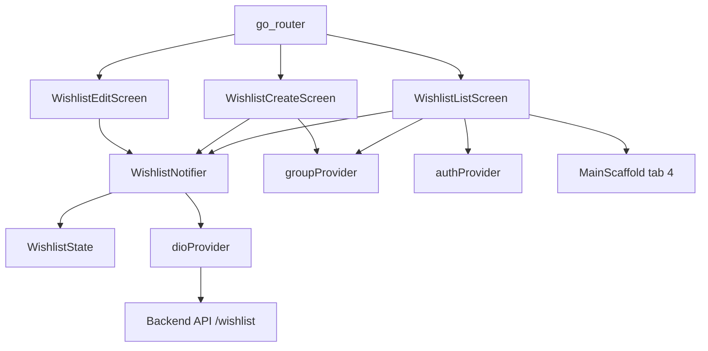
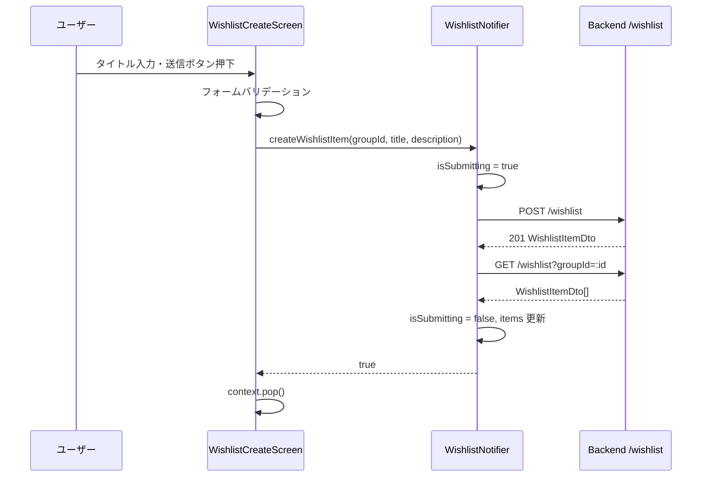
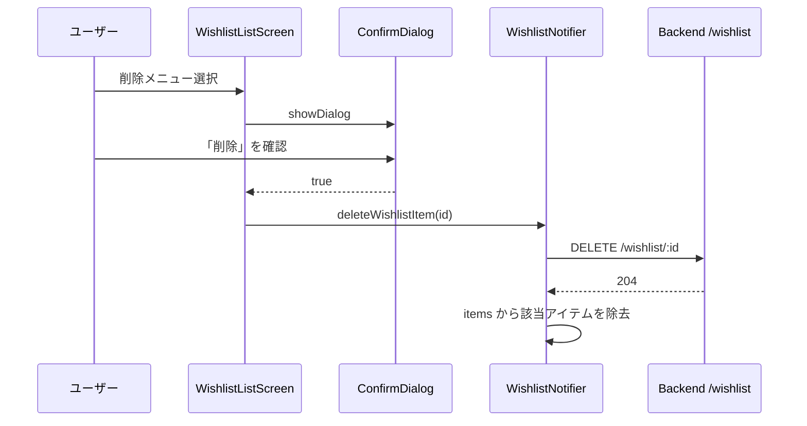

# 技術設計書: wishlist-frontend

## Overview

バックエンドに実装済みのウィッシュリスト API（`/wishlist` エンドポイント群）に対応する Flutter フロントエンド実装。グループメンバーが「欲しいアイテム」を投稿・閲覧・編集・削除できる画面群と状態管理を追加する。

**Purpose**: ウィッシュリスト機能をモバイルアプリから利用可能にし、グループメンバー間で欲しいアイテムを共有できるようにする。
**Users**: 認証済みのグループメンバー全員が投稿・閲覧・自分の投稿の編集/削除を行う。
**Impact**: 既存の `item`, `favorite`, `request` フィーチャーと同一パターンで新フィーチャーを追加。`MainScaffold` にボトムナビタブを1つ追加し、`router.dart` に3ルートを追加する。

### Goals

- グループ選択と連動したウィッシュリスト一覧の表示
- 自分の投稿の編集・削除（他ユーザーの投稿には操作不可）
- 既存 StateNotifier + Riverpod パターンへの完全準拠

### Non-Goals

- ウィッシュリストアイテムの詳細画面（一覧カードに表示情報で十分）
- ウィッシュリストと出品アイテムのマッチング
- プッシュ通知
- ページネーション（バックエンドAPIが全件返却）

---

## Architecture

### Existing Architecture Analysis

既存フィーチャーはすべて以下のパターンに統一されている:

- **状態管理**: `StateNotifier<XxxState>` + `StateNotifierProvider`（Riverpod）
- **HTTP**: `dioProvider`（JWT interceptor 付き）で全 API 呼び出し
- **ルーティング**: `go_router`（`routerProvider`）+ `_fadeSlidePage` トランジション
- **レイアウト**: `MainScaffold` が AppBar + BottomNavBar（4タブ）+ body を提供
- **グループ連携**: `groupProvider.selectedGroupId` を `ref.listen` で受け取り、ノーティファイアが内部 `_groupId` を更新して再取得

### Architecture Pattern & Boundary Map



**Architecture Integration**:
- Selected pattern: StateNotifier + StateNotifierProvider（既存フィーチャーと同一）
- Domain boundary: `features/wishlist/` として独立、他フィーチャーへの依存なし
- Existing patterns preserved: `dioProvider`, `groupProvider`, `authProvider`, `MainScaffold`, `go_router`
- New components: `WishlistItem`（モデル）, `WishlistState`, `WishlistNotifier`, 3画面
- Steering compliance: `structure.md` の「feature-based」フロントエンド構成に準拠

### Technology Stack

| Layer | Choice / Version | Role | Notes |
|-------|-----------------|------|-------|
| 状態管理 | flutter_riverpod（既存） | StateNotifier パターン | 変更なし |
| HTTP | dio（既存） | `/wishlist` CRUD API 呼び出し | 変更なし |
| ルーティング | go_router（既存） | 3ルート追加 | 変更なし |
| UI | Flutter / Material 3（既存） | 3画面追加 | 変更なし |

---

## Requirements Traceability

| Requirement | Summary | Components | Interfaces | Flows |
|-------------|---------|------------|------------|-------|
| 1.1–1.4 | WishlistItem モデル定義 | WishlistItem（models.dart） | `WishlistItem.fromJson` | — |
| 2.1–2.8 | 状態管理 CRUD | WishlistNotifier, WishlistState | `WishlistNotifierInterface` | API フロー |
| 3.1–3.10 | 一覧画面 | WishlistListScreen | — | — |
| 4.1–4.7 | 投稿画面 | WishlistCreateScreen | — | 投稿フロー |
| 5.1–5.7 | 編集画面 | WishlistEditScreen | — | 編集フロー |
| 6.1–6.6 | ルーティング・ナビゲーション | router.dart, MainScaffold | — | — |

---

## Components and Interfaces

| Component | Domain/Layer | Intent | Req Coverage | Key Dependencies | Contracts |
|-----------|-------------|--------|--------------|-----------------|-----------|
| WishlistItem | core/models | APIレスポンスの型安全なモデル | 1.1–1.4 | User（既存） | State |
| WishlistState | features/wishlist | 不変状態クラス | 2.1–2.2 | WishlistItem | State |
| WishlistNotifier | features/wishlist | Riverpod StateNotifier（CRUD） | 2.3–2.8 | dioProvider (P0), groupProvider (P1) | Service, State |
| WishlistListScreen | features/wishlist | グループ内ウィッシュリスト一覧 | 3.1–3.10 | WishlistNotifier (P0), authProvider (P1), groupProvider (P1) | — |
| WishlistCreateScreen | features/wishlist | 新規投稿フォーム | 4.1–4.7 | WishlistNotifier (P0), groupProvider (P0) | — |
| WishlistEditScreen | features/wishlist | 編集フォーム | 5.1–5.7 | WishlistNotifier (P0) | — |
| router.dart（更新） | core/routing | 3ルート追加 | 6.1–6.3, 6.6 | 全画面 (P0) | — |
| MainScaffold（更新） | widgets | BottomNavBar に5番目のタブ追加 | 6.4–6.5 | — | — |

---

### core/models

#### WishlistItem

| Field | Detail |
|-------|--------|
| Intent | バックエンドの `WishlistItemDto` に対応する不変 Dart モデル |
| Requirements | 1.1, 1.2, 1.3, 1.4 |

**Responsibilities & Constraints**
- `models.dart` の末尾に追加する（既存モデルと同一ファイル）
- `requester` フィールドは既存の `User` 型を再利用する
- 全フィールドは `final`（不変）

**Contracts**: State [x]

##### State Management

```dart
class WishlistItem {
  final int id;
  final String title;
  final String? description;
  final int groupId;
  final int requesterId;
  final User requester;
  final DateTime createdAt;
  final DateTime updatedAt;

  const WishlistItem({...});

  factory WishlistItem.fromJson(Map<String, dynamic> json);
}
```

- Invariants: `id`, `title`, `requester` は非 null。`description` は nullable

---

### features/wishlist — 状態管理

#### WishlistState

| Field | Detail |
|-------|--------|
| Intent | ウィッシュリスト画面群の不変状態クラス |
| Requirements | 2.1, 2.2 |

**Contracts**: State [x]

##### State Management

```dart
class WishlistState {
  final List<WishlistItem> items;
  final bool isLoading;
  final String? errorMessage;
  final bool isSubmitting;  // 投稿・編集・削除中のフラグ

  const WishlistState({...});

  WishlistState copyWith({
    List<WishlistItem>? items,
    bool? isLoading,
    String? errorMessage,
    bool clearError = false,
    bool? isSubmitting,
  });
}
```

---

#### WishlistNotifier

| Field | Detail |
|-------|--------|
| Intent | ウィッシュリスト CRUD 操作の StateNotifier |
| Requirements | 2.3, 2.4, 2.5, 2.6, 2.7, 2.8 |

**Responsibilities & Constraints**
- `_groupId`（内部フィールド）でグループ変更を管理（`ItemListNotifier` と対称的パターン）
- `setGroupId(int)` でグループ変更時に自動再取得
- 所有者判定はビューレイヤーで実施（`authState.accountId == item.requester.accountId`）

**Dependencies**
- Inbound: WishlistListScreen, WishlistCreateScreen, WishlistEditScreen (P0)
- Outbound: dioProvider — HTTP API (P0)

**Contracts**: Service [x], State [x]

##### Service Interface

```dart
class WishlistNotifier extends StateNotifier<WishlistState> {
  void setGroupId(int groupId);
  Future<void> loadWishlistItems(int groupId);
  Future<bool> createWishlistItem({
    required int groupId,
    required String title,
    String? description,
  });
  Future<bool> updateWishlistItem({
    required int id,
    required String title,
    String? description,
  });
  Future<bool> deleteWishlistItem(int id);
}

final wishlistProvider =
    StateNotifierProvider<WishlistNotifier, WishlistState>(...);
```

- Preconditions: `loadWishlistItems` — `_groupId != null`
- Postconditions: `createWishlistItem` 成功後 → `loadWishlistItems` 再呼び出しで一覧更新
- Postconditions: `deleteWishlistItem` 成功後 → state.items から該当アイテムを即時除去（楽観的更新は不採用、再取得で整合性を保つ）
- 戻り値 `bool`: 成功時 `true`、API エラー時 `false`（errorMessage にセット）

**Implementation Notes**
- `setGroupId` は `groupId` が変わった場合のみ `loadWishlistItems` を呼ぶ（`ItemListNotifier.setGroupId` と同一ロジック）
- API エラー時は `e.response?.data?['message']?.toString()` をフォールバックメッセージで `errorMessage` にセット

---

### features/wishlist — 画面

#### WishlistListScreen

| Field | Detail |
|-------|--------|
| Intent | 選択中グループのウィッシュリスト一覧を表示し、CRUD 操作のエントリポイントを提供する |
| Requirements | 3.1–3.10 |

**Responsibilities & Constraints**
- `ConsumerStatefulWidget` で実装（`initState` でグループ読み込みと初回取得）
- `ref.listen` で `groupProvider.selectedGroupId` の変更を検知し `setGroupId` を呼び出す
- 所有者判定: `ref.watch(authProvider).accountId == item.requester.accountId`
- 削除前に `showDialog` で確認ダイアログを表示

**Dependencies**
- Inbound: go_router `/wishlist` (P0)
- Outbound: wishlistProvider (P0), authProvider (P1), groupProvider (P1)

**Implementation Notes**
- `selectedIndex: 4` で `MainScaffold` を使用
- `FloatingActionButton`（`card_giftcard_rounded` アイコン, `リクエストを投稿`）で `/wishlist/create` へ push
- グループ未選択時は「グループを選択してください」メッセージを中央表示（ボタンなし）
- 空状態: `wish_rounded` アイコン + 「ウィッシュリストはまだありません」テキスト

---

#### WishlistCreateScreen

| Field | Detail |
|-------|--------|
| Intent | ウィッシュリストアイテム新規投稿フォーム |
| Requirements | 4.1–4.7 |

**Responsibilities & Constraints**
- `ConsumerStatefulWidget` で実装
- `GlobalKey<FormState>` によるバリデーション（タイトル必須・空文字禁止）
- `isSubmitting` が true の間、送信ボタンを無効化して二重送信を防ぐ

**Dependencies**
- Inbound: go_router `/wishlist/create` (P0)
- Outbound: wishlistProvider (P0), groupProvider (P0)

**Implementation Notes**
- `groupProvider.selectedGroupId` が null の場合、`SnackBar` でエラー表示して送信中断
- 成功後: `context.pop()` で一覧画面に戻る
- API エラー時: `SnackBar`（赤背景）でエラーメッセージを表示

---

#### WishlistEditScreen

| Field | Detail |
|-------|--------|
| Intent | 既存ウィッシュリストアイテムの編集フォーム |
| Requirements | 5.1–5.7 |

**Responsibilities & Constraints**
- コンストラクタで `WishlistItem item` を受け取る（`state.extra as WishlistItem` でルーターから渡す）
- `initState` で既存の `title`, `description` をコントローラーにセット
- `WishlistCreateScreen` と同一のバリデーション・二重送信防止ロジック

**Dependencies**
- Inbound: go_router `/wishlist/:id/edit` （`state.extra as WishlistItem`） (P0)
- Outbound: wishlistProvider (P0)

---

### core/routing — router.dart（更新）

3ルートを追加し、`_fadeSlidePage` トランジションを適用する。

```
/wishlist           → WishlistListScreen()
/wishlist/create    → WishlistCreateScreen()
/wishlist/:id/edit  → WishlistEditScreen(item: state.extra as WishlistItem)
```

**Implementation Notes**
- `/wishlist/:id/edit` は `state.extra as WishlistItem` で一覧画面からアイテムを渡す（`ItemEditScreen` と同パターン）

---

### widgets — MainScaffold（更新）

BottomNavigationBar に5番目のタブを追加する。

```dart
// 追加するタブ
BottomNavigationBarItem(
  icon: Icon(Icons.card_giftcard_rounded),
  label: 'ほしい物',
)

// onTap に追加
case 4:
  context.go('/wishlist');
```

**Implementation Notes**
- `selectedIndex: 4` を渡す画面: `WishlistListScreen`（既存画面の `selectedIndex` 値は変更不要）

---

## System Flows

### 投稿フロー



### 削除フロー



---

## Data Models

### Domain Model

- Aggregate: `WishlistItem`（id, title, description?, groupId, requesterId, requester, createdAt, updatedAt）
- `requester` は `User` 型（id, accountId, name）の値オブジェクト
- クライアント側は読み取り専用モデル。Invariants: `id`, `groupId`, `requesterId` は作成後変更不可（バックエンド保証）

### Logical Data Model（フロントエンドモデル）

```
WishlistItem
  id           : int        必須
  title        : String     必須
  description  : String?    任意
  groupId      : int        必須
  requesterId  : int        必須
  requester    : User       必須（id, accountId, name）
  createdAt    : DateTime   必須
  updatedAt    : DateTime   必須
```

### Data Contracts & Integration

**API レスポンス（GET /wishlist?groupId）**:
```json
[
  {
    "id": 1,
    "title": "掃除機",
    "description": null,
    "groupId": 1,
    "requesterId": 3,
    "requester": { "id": 3, "accountId": "user001", "name": "田中" },
    "createdAt": "2026-03-27T00:00:00.000Z",
    "updatedAt": "2026-03-27T00:00:00.000Z"
  }
]
```

**API リクエスト（POST /wishlist）**:
```json
{ "title": "掃除機", "description": null, "groupId": 1 }
```

**API リクエスト（PATCH /wishlist/:id）**:
```json
{ "title": "掃除機（新品）", "description": "コードレスタイプ希望" }
```

---

## Error Handling

### Error Strategy

- バリデーションエラー（空タイトル）: `Form.validate()` でクライアント側で早期検出
- API エラー: `DioException.response?.data?['message']` を `WishlistState.errorMessage` に格納
- 操作エラー（403, 404）: `SnackBar`（赤背景）でユーザーに通知

### Error Categories and Responses

| Category | Condition | 対応 |
|----------|-----------|------|
| バリデーション | タイトル空 | フォームエラーメッセージ表示（送信不可） |
| 認証エラー | 401 | dioProvider interceptor が token をクリア → router がログイン画面へリダイレクト |
| 認可エラー | 403 | SnackBar でエラーメッセージ表示 |
| 未発見 | 404 | SnackBar でエラーメッセージ表示 |
| 通信エラー | ネットワーク障害 | SnackBar でフォールバックメッセージ（「読み込みに失敗しました」）表示 |

### Monitoring

既存の NestJS 標準ロギングでサーバー側エラーを記録（フロントエンド固有の監視設定なし）。

---

## Testing Strategy

### Unit Tests

- `WishlistItem.fromJson`: 正常系・`description=null` のケース
- `WishlistNotifier.loadWishlistItems`: API 成功でステート更新・groupId が null のとき何もしない
- `WishlistNotifier.createWishlistItem`: 成功時 `true` 返却・失敗時 `errorMessage` セット
- `WishlistNotifier.deleteWishlistItem`: 成功時 `items` から除去
- `WishlistState.copyWith`: `clearError` フラグの動作確認

### Widget Tests

- `WishlistListScreen`: ローディング中の `CircularProgressIndicator` 表示・空状態表示・自分の投稿に編集/削除メニューが出る・他人の投稿にメニューが出ない
- `WishlistCreateScreen`: タイトル空でバリデーションエラー・送信中ボタン無効化
- `WishlistEditScreen`: 既存値の初期セット確認

### Integration Tests（手動確認）

- `POST /wishlist`: 正常投稿 → 一覧に追加表示
- `PATCH /wishlist/:id`: 自分の投稿を編集 → 一覧に更新反映
- `DELETE /wishlist/:id`: 自分の投稿を削除 → 一覧から消える
- 他人の投稿: 編集・削除ボタンが非表示

---

## Security Considerations

- JWT は `dioProvider` interceptor で全リクエストに自動付与（既存設定流用）
- 所有者判定（編集・削除ボタン表示）はクライアント側でも実施するが、サーバー側 `WishlistItemOwnerGuard` が最終的な権限確認を行う
- 他ユーザーが直接 API を叩いても 403 で拒否される（クライアント側判定はUX最適化のみ）
